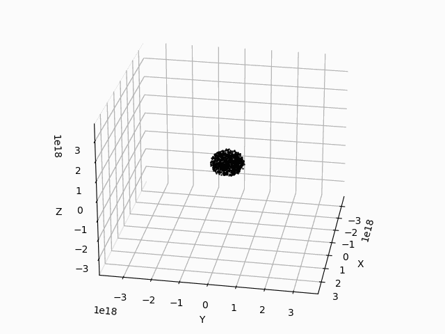

# Galaxy simulation

This repository contain some Python and shell scripts in order to do a simple simulation of a galaxy. We compute the trajectories of a thousand of stars. We use the PP method (for Particule-Particule) and we'll try after the implement a MP method (for Mesh-Particule). This repository contain :

- **main.py** : This file is the main file with the main *for loop*. We compute the sum of all forces on each particules by the others. We install a cut-off in order to limit the computing time.

- **anim.py** : This file allows to create and save the animation that we produce by the *FuncAnimation* Python module.

- **run_simu.sh** : This shell script allows to run the *main.py* file and give some argument like the number of stars N, the computing time t or the time integration dt for example.

- **run_anim.sh** : This shell script allows to run the *anim.py* file and give argument to it.

# Results

Here we have the results of the simulation for 1000 stars and for a 15 parsec cut-off. We observe a formation of two galaxies. On the right we have the number of stars in a region. On the left, we just plot the position of each stars.

Here we have the same simulation but in 3 dimensions. 

